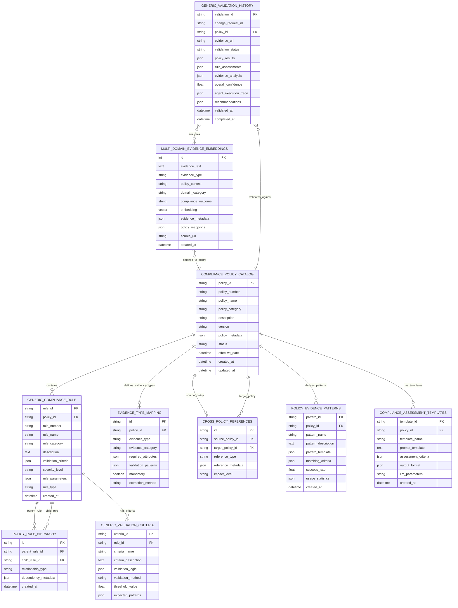

# Generic Compliance Validation System - Complete Mermaid Architecture

## System Overview
**Universal Multi-Policy Compliance Validation System** designed to handle any compliance policy dynamically loaded from Spanner Graph. 

**Example Policies Supported:**
- **Policy 101 - Test Execution**: Test scripts, data, plans, outcomes, defects
- **Policy 201 - Security Compliance**: Security scans, vulnerability assessments, pen testing
- **Policy 301 - Deployment Validation**: Deployment procedures, rollback plans, monitoring
- **Policy 401 - Code Review**: Code quality, peer reviews, static analysis
- **Policy 501 - Documentation**: Technical documentation, API docs, user guides
- **...and any future policies added to Spanner Graph**

## 1. Generic System Architecture


**Key Generic Features:**
- **Policy-Agnostic Design**: Dynamically processes any compliance policy from Spanner Graph
- **Universal Evidence Parser**: Handles multi-format evidence (test docs, security reports, deployment logs)
- **Generic Agent Pipeline**: Policy-aware agents that adapt to different compliance domains
- **Multi-Policy Knowledge Store**: Supports unlimited compliance policies with cross-references
- **Dynamic Rule Loading**: Runtime retrieval and processing of policy-specific rules
- **Universal Decision Framework**: Consistent compliance assessment across all policy types

## 2. Generic Multi-Policy Agent Workflow


**Generic Workflow Steps:**
1. **Dynamic Policy Detection**: Auto-identify applicable compliance policies from context
2. **Universal Evidence Parsing**: Extract and classify evidence regardless of domain
3. **Policy-Specific Rule Loading**: Dynamically fetch relevant rules from Spanner Graph
4. **Multi-Domain Context Building**: Hybrid retrieval across policy domains
5. **Generic Compliance Assessment**: Policy-agnostic evaluation with domain expertise
6. **Universal Result Format**: Consistent output structure for all policy types

## 3. Generic Hybrid RAG Pipeline

```mermaid
graph TB
    subgraph "Multi-Format Evidence Input"
        EI[Evidence Input<br/>Any Policy Context]:::input
        EC[Evidence Content<br/>Universal Parser]:::process
        ET[Evidence Type<br/>Auto-Classification]:::process
    end

    subgraph "Dynamic Policy Context"
        PC[Policy Context<br/>Runtime Identification]:::policy
        PDR[Policy Discovery<br/>Automated Detection]:::policy
        PLC[Policy Loading<br/>Dynamic Rule Retrieval]:::policy
    end

    subgraph "Generic Hybrid Retrieval"
        GVR[Generic Vector Retrieval<br/>Multi-Domain Similarity]:::vector
        GGR[Generic Graph Retrieval<br/>Policy-Agnostic Structure]:::graph
        HRS[Hybrid Retrieval Strategy<br/>Context-Aware Combination]:::hybrid
    end

    subgraph "Multi-Domain Vector Pipeline"
        UVE[Universal Vector Embeddings<br/>Domain-Agnostic Processing]:::process
        MVS[Multi-Domain Vector Search<br/>Cross-Policy Similarity]:::process
        SPE[Similar Policy Evidence<br/>Historical Patterns]:::result
    end

    subgraph "Generic Knowledge Graph Pipeline"
        DGQ[Dynamic Graph Query<br/>Policy-Specific GQL]:::process
        PRT[Policy Rule Traversal<br/>Hierarchical Navigation]:::process
        GCR[Generic Compliance Rules<br/>Policy-Agnostic Structure]:::result
    end

    subgraph "Adaptive Context Integration"
        ACF[Adaptive Context Fusion<br/>Policy-Aware Weighting]:::integration
        DPE[Dynamic Prompt Engineering<br/>Policy-Specific Templates]:::integration
        ERP[Enhanced RAG Prompt<br/>Context + Rules + Examples]:::integration
    end

    subgraph "Generic LLM Processing"
        GLLM[Gemini 2.5 Pro<br/>Multi-Policy Reasoning]:::llm
        PRA[Policy-Specific Rule Analysis<br/>Dynamic Evaluation]:::analysis
        GCD[Generic Compliance Decision<br/>Policy-Agnostic Output]:::decision
    end

    %% Flow connections
    EI --> EC
    EC --> ET
    ET --> UVE

    PC --> PDR
    PDR --> PLC
    PLC --> DGQ

    UVE --> MVS
    MVS --> SPE

    DGQ --> PRT
    PRT --> GCR

    SPE --> ACF
    GCR --> ACF
    ACF --> DPE
    DPE --> ERP
    ERP --> GLLM

    GLLM --> PRA
    PRA --> GCD

    GVR -.-> UVE
    GGR -.-> DGQ
    HRS -.-> ACF

    %% Styling
    classDef input fill:#e6f3ff,stroke:#0066cc,stroke-width:2px
    classDef policy fill:#f0e6ff,stroke:#9900cc,stroke-width:2px
    classDef vector fill:#ffe6e6,stroke:#cc0000,stroke-width:2px
    classDef graph fill:#e6ffe6,stroke:#009900,stroke-width:2px
    classDef hybrid fill:#fff2cc,stroke:#d6b656,stroke-width:2px
    classDef process fill:#fff2e6,stroke:#ff8800,stroke-width:2px
    classDef result fill:#f0e6ff,stroke:#9900cc,stroke-width:2px
    classDef integration fill:#fffacd,stroke:#daa520,stroke-width:2px
    classDef llm fill:#e6f2ff,stroke:#0044cc,stroke-width:3px
    classDef analysis fill:#f5f5dc,stroke:#8b7d6b,stroke-width:2px
    classDef decision fill:#f0f8f0,stroke:#009900,stroke-width:2px
```

**Multi-Policy RAG Features:**
- **Domain-Agnostic Vector Search**: Cross-policy evidence similarity matching
- **Dynamic Graph Traversal**: Policy-specific rule navigation in Spanner Graph
- **Adaptive Context Fusion**: Policy-aware weighting of graph vs vector results
- **Dynamic Prompt Engineering**: Policy-specific assessment templates
- **Multi-Domain Reasoning**: LLM adaptation to different compliance domains

## 4. Generic Multi-Policy Database Schema



**Schema Features:**
- **Policy Catalog**: Central registry of all compliance policies
- **Generic Rule Structure**: Flexible rule definition supporting any policy type
- **Policy Hierarchies**: Support for rule dependencies and cross-references
- **Evidence Type Mapping**: Dynamic evidence classification per policy
- **Cross-Policy References**: Links between related policies and rules
- **Multi-Domain Embeddings**: Vector storage for all evidence types
- **Generic Assessment Templates**: LLM prompt templates per policy type

## Multi-Policy Support Examples

### Policy 101 - Test Execution
```json
{
  "policy_id": "POL-101",
  "policy_name": "Test_Execution",
  "rules": [
    {"rule_number": "1", "description": "Test Evidence consists of test scripts, test data and test plan"},
    {"rule_number": "2", "description": "Test executed traceable to functional and non functional requirements"},
    {"rule_number": "3", "description": "Test outcomes includes expected results vs actual results"},
    {"rule_number": "4", "description": "Any deviation from test strategy are documented and approved"},
    {"rule_number": "5", "description": "Identified defects are documented, reviewed and approved"}
  ]
}
```

### Policy 201 - Security Compliance  
```json
{
  "policy_id": "POL-201",
  "policy_name": "Security_Compliance",
  "rules": [
    {"rule_number": "1", "description": "Security scanning completed for all code changes"},
    {"rule_number": "2", "description": "Vulnerability assessment results documented and remediated"},
    {"rule_number": "3", "description": "Penetration testing performed for high-risk changes"},
    {"rule_number": "4", "description": "Security approvals obtained from InfoSec team"},
    {"rule_number": "5", "description": "Compliance with security standards validated"}
  ]
}
```

### Policy 301 - Deployment Validation
```json
{
  "policy_id": "POL-301", 
  "policy_name": "Deployment_Validation",
  "rules": [
    {"rule_number": "1", "description": "Deployment procedures documented and approved"},
    {"rule_number": "2", "description": "Rollback plan tested and verified"},
    {"rule_number": "3", "description": "Production monitoring and alerting configured"},
    {"rule_number": "4", "description": "Database migration scripts validated"},
    {"rule_number": "5", "description": "Performance impact assessment completed"}
  ]
}
```

## Generic Technology Stack

| Component | Technology | Generic Purpose |
|-----------|------------|-----------------|
| **Workflow Engine** | LangGraph | Policy-agnostic multi-agent orchestration |
| **Knowledge Graph** | Spanner Graph | Universal compliance policy and rule storage |
| **Vector Database** | AlloyDB | Multi-domain evidence embeddings and similarity |
| **LLM Engine** | Gemini 2.5 Pro | Generic compliance reasoning across all domains |
| **Embeddings** | Vertex AI | Domain-agnostic text-to-vector transformation |
| **Evidence Source** | Confluence | Universal documentation and evidence repository |

## Extensibility Features

### Adding New Policies
1. **Define Policy Structure** in Spanner Graph with rules and validation criteria
2. **Create Evidence Mappings** for policy-specific evidence types  
3. **Configure Assessment Templates** for LLM evaluation prompts
4. **Add Domain Examples** to AlloyDB vector store for similarity matching
5. **System Automatically Adapts** - no code changes required

### Cross-Policy Support
- **Policy Dependencies**: Rules that reference other policies
- **Shared Evidence**: Evidence that satisfies multiple policies
- **Combined Assessments**: Multi-policy validation in single workflow
- **Policy Conflicts**: Detection and resolution of conflicting requirements

### Domain Expansion
- **New Evidence Types**: Automatic classification and processing
- **Custom Validation Logic**: Policy-specific assessment criteria
- **Domain Expertise**: LLM adaptation to specialized compliance areas
- **Industry Standards**: Support for regulatory and industry-specific policies

This generic architecture provides unlimited scalability for compliance validation across any domain or policy type while maintaining consistent quality and explainability.
